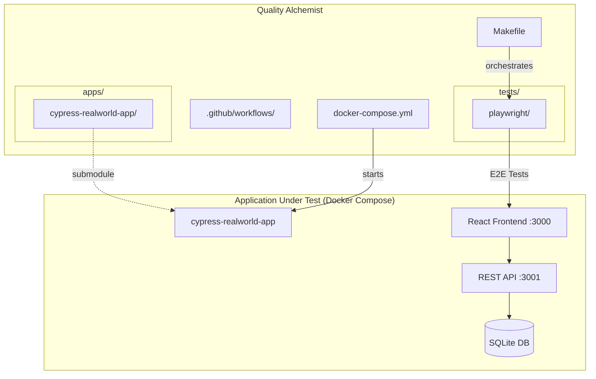

# 🧪 Quality Alchemist 🧙‍♂️


QA portfolio demonstrating automation engineering proficiency in Playwright.

[](https://github.com/avramare/quality-alchemist/actions/workflows/playwright.yml)

---

## Architecture



---

## Test Suite

Running against the [cypress-realworld-app](https://github.com/cypress-io/cypress-realworld-app), a Venmo-like financial application with authentication, transactions, notifications, and user profiles.

### 🎭 Playwright — TypeScript E2E

**Pattern**: Page Object Model | **Browsers**: Chromium, Firefox

```
tests/playwright/
├── pages/          → LoginPage, SignUpPage, TransactionPage, NotificationPage
├── tests/          → login, signup, transaction, notification specs
└── playwright.config.ts
```

**Tests**: Successful/failed login · User registration · Transaction creation · Notifications
**Reports**: Interactive HTML with failure screenshots and traces for debugging

📂 [View code](tests/playwright/) · 📄 [View README](tests/playwright/README.md)

---

## CI/CD

Test suite has its own GitHub Actions workflow. It runs  on every push/PR to `main`.

```
.github/workflows/
└── playwright.yml    → Build Docker → Playwright tests → Publish HTML report
```

Workflow steps:
1. Clones the repo with the AUT submodule
2. Builds and starts the app with Docker Compose
3. Runs the test suite
4. Publishes reports as downloadable artifacts (from the Actions tab)
5. Tears down the container

---

## Project Structure

```
quality-alchemist/
├── apps/
│   └── cypress-realworld-app/    # AUT (Git submodule)
├── tests/
│   └── playwright/               # TypeScript E2E
├── .github/workflows/            # CI/CD pipeline
├── docker-compose.yml            # AUT orchestration
├── Dockerfile                    # AUT Docker image
├── Makefile                      # Unified interface
└── .env                          # Environment variables
```

---

## Running Locally

<details>
<summary><strong>Prerequisites</strong></summary>

| Tool | Verify |
|---|---|
| Git | `git --version` |
| Docker + Docker Compose | `docker compose version` |
| Node.js 18+ | `node --version` |

</details>

<details>
<summary><strong>Installation</strong></summary>

```bash
# Clone with submodules
git clone --recurse-submodules https://github.com/avramare/quality-alchemist.git
cd quality-alchemist

# If you already cloned without submodules
git submodule update --init --recursive

# Install dependencies
cd tests/playwright && npm install && npx playwright install --with-deps
```

</details>

<details>
<summary><strong>Running tests</strong></summary>

```bash
# Start the app
make start-aut

# Run tests
make test-all

# Stop the app
make stop-aut
```

</details>

---

## Tech Stack

| Category | Technologies |
|---|---|
| **E2E Testing** | Playwright |
| **Languages** | TypeScript |
| **Test Runners** | Playwright Test |
| **CI/CD** | GitHub Actions |
| **Infrastructure** | Docker Compose, Makefile |
| **Reports** | Playwright HTML |

---