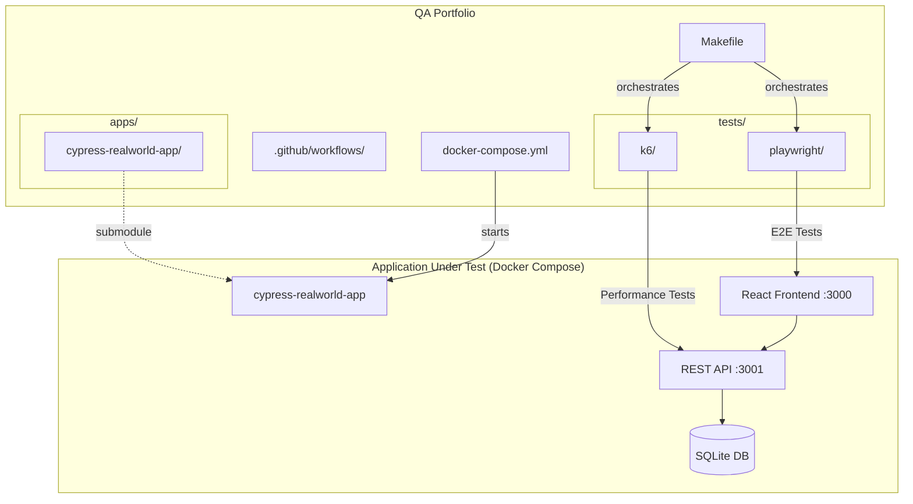

```mermaid
graph TB
    subgraph "QA Portfolio"
        subgraph "apps/"
            RWA_SUB[cypress-realworld-app/]
        end
        subgraph "tests/"
            PW[playwright/]
            K6[k6/]
        end
        DC[docker-compose.yml]
        MK[Makefile]
        GH[.github/workflows/]
    end

    subgraph "Application Under Test (Docker Compose)"
        RWA[cypress-realworld-app]
        API[REST API :3001]
        UI[React Frontend :3000]
        DB[(SQLite DB)]
    end

    RWA_SUB -.->|submodule| RWA
    DC -->|starts| RWA
    MK -->|orchestrates| PW
    MK -->|orchestrates| K6

    PW -->|E2E Tests| UI
    K6 -->|Performance Tests| API

    UI --> API
    API --> DB
```